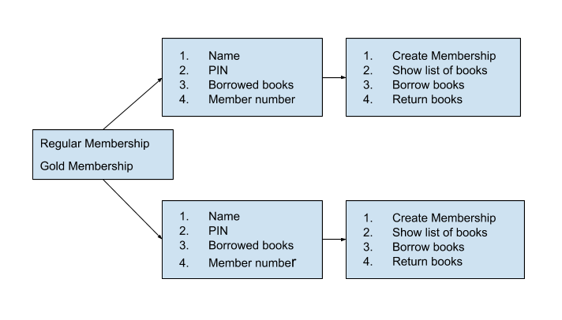

### PROJECT TITLE:
Library Management Application

### DESCRIPTION:

This application includes four methods-
- Create Membership-
   This method helps you create either Regular membership or Gold membership.
- Display list of books-
   This method lists out the books that are available in the library.
- Borrow books-
   This method helps you borrow the available books.
- Ruturn books-
   This method helps you return books that were previously borrowed.

### SOFTWARE INSTALLATION GUIDE:
- In order to execute this application we require to install Python 3.7.2. The latest version can be installed using the following link https://www.python.org/downloads/
- Sublime Text is another important software required to execute this application which can be installed using the following link https://www.sublimetext.com/3

### DEPLOYMENT:
- First of all, create a new folder preferably on your Desktop. 
- Now open Sublime Text and copy the code present in library_manager.py(uploaded on github) and save it as library_manager.py in the folder just created. 
- Similarly, follow the above procedure for main.py. 
- Open command prompt or terminal on your system. Navigate the path of the folder created. Follow the steps in order to link the folder's path:
     1. On opening terminal, "apples-MacBook-Pro:~ apple$" appears, type "ls" against this line.
     2. Now type "cd Desktop/" provided your folder exists on your Desktop.
     3. "apples-MacBook-Pro:Desktop apple$" this implies that we have now successfully navigated to Desktop. Type "ls" against this and hit enter.
     4. All the folders available on your desktop now appears, choose your folder by typing "cd 'YOUR FOLDER NAME'/ ".
     5. You have now successfully directed your folder to Terminal. Let's run our code now, "apples-MacBook-Pro:apple$ 'YOUR FOLDER NAME/ " type "python3 main.py"

### HOW TO USE:
Once main.py is navigated successfully, four choices appear.
 - On typing "1" you can create either regular membership or gold membership. Regular members can borrow atmost one book at a time and Gold members can borrow one or two books at a time. Membership ID is provided after taking your name and password as inputs. Using the membership ID and password you will be able to access the other functions that follow. 
 - On typing "2" a list of the books available in the library is shown. 
 - On typing "3", you will be able to borrow the book of your choice and your transaction is recorded.
 - On typing "4", you will be able to return the books borrowed as per your transaction history.

 ### FLOWCHART:

